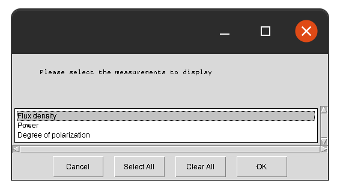
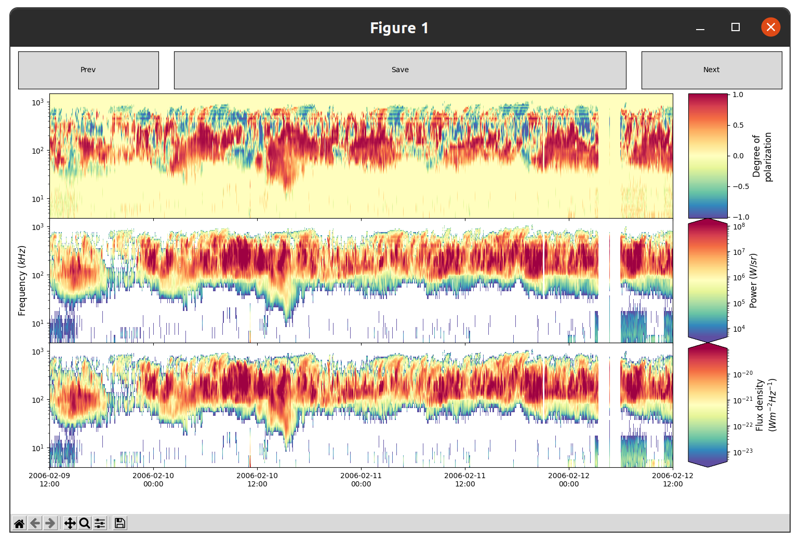

# SPACE Labelling Tool

Utility to allow for identification of radio features from spacecraft observations via a GUI.

## Getting Started

Clone this repository, and then install it in 'editable' mode as:

```shell
git clone https://github.com/CorentinLouis/SPACE_labelling_tool.git
pip install -e SPACE_labelling_tool
```
Installing in editable mode will allow the scripts to read any new or modified versions of the configuration files.

## Usage

```shell
space_label.py [-h] [-s SPACECRAFT] FILE DATE DATE
```

**Positional arguments:**
* `FILE`: The name of the `.hdf5` file to analyse. 
  It must be in the format outlined in the [data_dictionary](docs/data_dictionary.md); three (or more) columns!
* `DATE`: The window of days to plot, in ISO YYYY-MM-DD format, e.g. '2003-12-1 2003-12-31' for December 2003.
  The data will be scrolled through in blocks of this window's width.

**Optional arguments:**
* `-h`, `--help`: Shows help documentation.
* `-s SPACECRAFT`: The name of the spacecraft. Auto-detected from the input file columns, 
  but required if multiple spacecraft describe the same input file. Valid options are: cassini, juno.

The code will attempt to identify which spacecraft the data file format corresponds to, and read the file intelligently.
If it can't fit one of them, it will prompt the user to create a new spacecraft configuration file.
In the case of a file matching multiple spacecraft formats, the user is prompted to select one.

### GUI

Once the file has loaded, it launches a GUI for selecting the measurements within the file to display, 
and then to navigate the data selected. 
The plot will display the time range selected, plus a 0.5 day window either side.

There are the following interactive components:
* **Measurements:** Each pane displays a measurement, with name, scale and units on the right. 
  Features can be drawn by clicking to add coordinates, and completed by clicking on the first coordinate added again.
  Once selected, a feature can be named. Features can be selected on any pane, and will be mirrored on all other panes.
* **Prev/Next buttons:** These move through the data by an amount equal to the width of time range selected. 
  This will also apply a 0.5 day window of overlap as 'padding'.
* **Save button:** This will save any features to TFcat JSON format, as `FILE.json`.

Once finished, you can save and then close the figure using the normal close button.

### Usage Examples

Calling the code as:
```shell
space_label.py cassini_data.hdf5 2006-02-10 2006-02-11
```
Will load the file `cassini_data.hdf5`, and prompt the user to select which measurements to display:



Once selected, the radio observations will be displayed
for the time window 10/2/2006 to 11/2/2006, plus some 1/2 day padding either side:



## Documentation

Spacecraft configuration files are stored in the `config/` directory in JSON format. 
For more info on how to create a new one, see [spacecraft configurations](docs/spacecraft_configurations.md).

Information on the file formats this program inputs and outputs can be found in the [data dictionary](docs/data_dictionary.md).

## Terminology

* 'Polarization' has been chosen over 'Polarisation' as it is the Oxford standard for the spelling.
