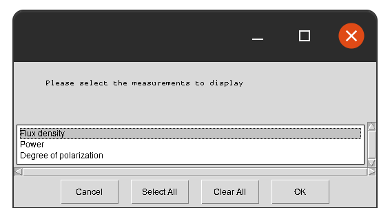
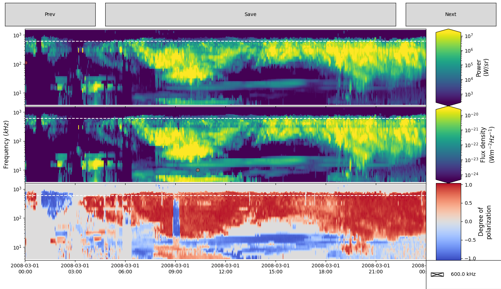
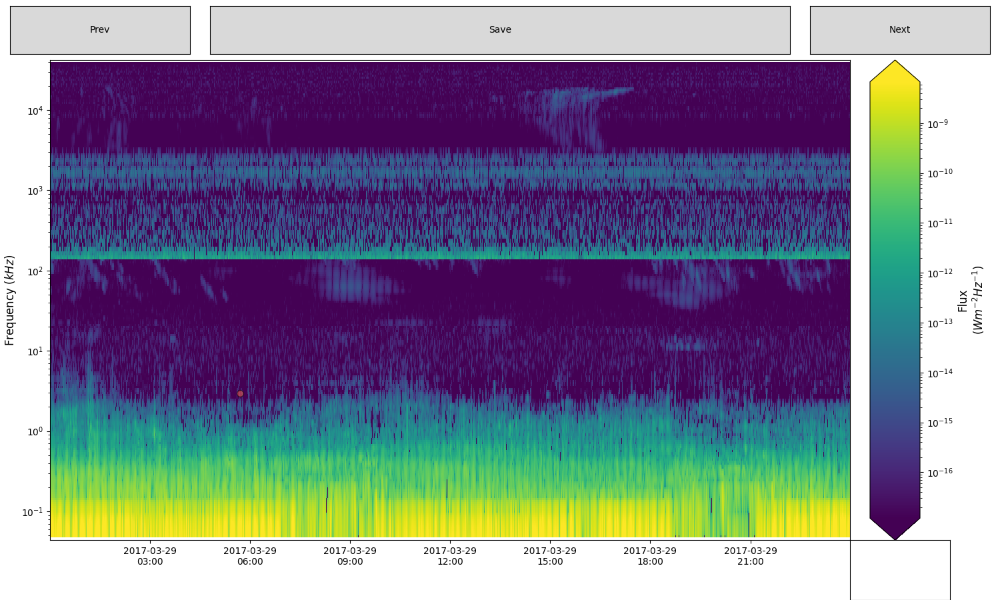
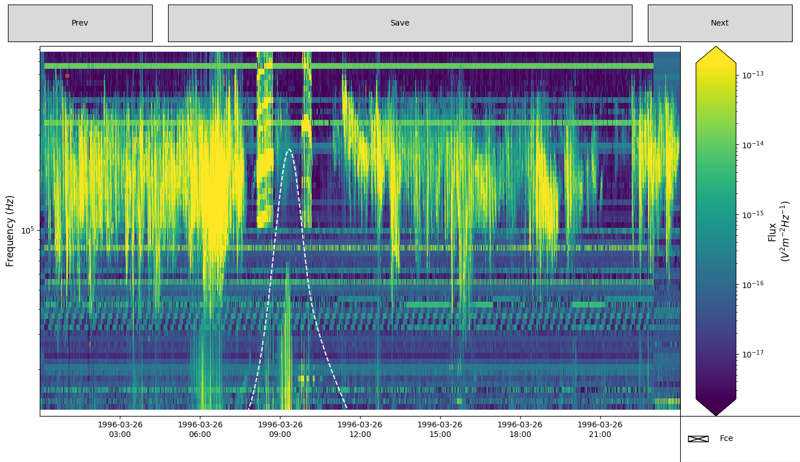

# SPACE Labelling Tool V2.0.0

[](https://doi.org/10.5281/zenodo.6886528)
[](https://space-labelling-tool.readthedocs.io/en/latest)
[](https://opensource.org/licenses/MIT)

Utility to allow for identification of radio features from spacecraft observations via a GUI.

## Getting Started

Clone this repository, and then install it in 'editable' mode as:

```shell
git clone https://github.com/CorentinLouis/SPACE_labelling_tool.git
pip install -e SPACE_labelling_tool
```

Installing in editable mode will allow the scripts to read any new or modified versions of the configuration files.

SPACE Labelling Tool is also directly available from PyPi: https://pypi.org/project/SPACE-Labelling/

```shell
pip install SPACE-Labelling
```


## Usage

```shell
spacelabel [-h] [-s SPACECRAFT] FILE DATE DATE
```

**Positional arguments:**
* `FILE`: The name of the `.hdf5` or `.cdf` file to analyse. 
  It must be in the format outlined in the [data_dictionary](docs/source/data_dictionary.md); three (or more) columns!
* `DATE`: The window of days to plot, in ISO YYYY-MM-DD format, e.g. '2003-12-01 2003-12-31' for December 2003.
  The data will be scrolled through in blocks of this window's width.

**Optional arguments:**
* `-h`, `--help`: Shows help documentation.
* `-s SPACECRAFT`: The name of the spacecraft. Auto-detected from the input file columns, 
  but required if multiple spacecraft describe the same input file.
* `-f FREQUENCY`: How many log-space frequency bins to rebin the data to. Overrides any default for the spacecraft.
* `-t TIME_MINIMUM`: How small the minimum time bin should be, in seconds. This must be an even multiple of the current 
  time bins, e.g. a file with 1s time bins could have a minimum time bin of 15s.
* `-fig_size FIGURE_SIZE FIGURE_SIZE`: x and y dimension of the matplotlib figure (by default: 15 9)
* `-frac_dyn_range FRAC_DYN_RANGE FRAC_DYN_RANGE`: The minimum and maximum fraction of the flux to be display in the dynamic range (by default: 0.05 0.95)
* `-cmap CMAP`: The name of the color map that will be used for the intensity plot (by default: viridis)
* `-cfeatures CFEATURES`: The name of the colour for the saved features of interest polygons (by default: tomato)
* `-thickness_features TFEATURES`: The thickness value for the saved features of interest polygons (by default: 2)
* `-size_features_name SFEATURESNAME`: The font size for the name of the saved features of interest polygons (by default: 14)
* `-g [FREQUENCY_GUIDE [FREQUENCY_GUIDE ...]]`: Draws horizontal line(s) on the visualisation at these specified frequencies to aid in interpretation of the plot.Values must be in the same units as the data.Lines can be toggled using check boxes.
* `--not_verbose`: If not_verbose is called, the debug log will not be printed. By default: verbose mode


The code will attempt to identify which spacecraft the data file format corresponds to, and read the file intelligently.
If it can't fit one of them, it will prompt the user to create a new spacecraft configuration file.
In the case of a file matching multiple spacecraft formats, the user is prompted to select one.

### GUI

Once the file has loaded, it launches a GUI for selecting the measurements within the file to display, 
and then to navigate the data selected. 
The plot will display the time range selected, plus 1/4 of the previous window.

There are the following interactive components:
* **Measurements:** Each pane displays a measurement, with name, scale and units on the right. 
  Features can be drawn by clicking to add coordinates, and completed by clicking on the first coordinate added again. The vertices of the polygon can be modified before completed the polygon:
  * Hold _ctrl_ and click and drag a vertex to reposition it before the polygon has been completed.
  * Hold the _shift_ key and click and drag anywhere in the axes to move all vertices.
  * Press the _esc_ key to start a new polygon.

  Once selected, a feature can be named. Features can be selected on any pane, and will be mirrored on all other panes.
* **Prev/Next buttons:** These move through the data by an amount equal to the width of time range selected. 
  This will also overlap 1/4 of the current window as 'padding'.
* **Save button:** This will save any features to TFcat JSON format, as `catalogue_{OBSERVER_NAME}.json`.

Once finished, you can save and then close the figure using the normal close button.

### Usage Examples

* `hdf5` file
Calling the code as:
```shell
space_label.py cassini_data.hdf5 2006-02-10 2006-02-11 -g 600
```
Will load the file `cassini_data.hdf5`, and prompt the user to select which measurements to display:



Once selected, the radio observations will be displayed
for the time window 10/2/2006 to 11/2/2006:




* `cdf` file
Calling the code as:
```shell
space_label.py juno_data.cdf 2017-03-29 2017-03-30
```
Will first load the file `juno_data.cdf`, processed it into `hdf5` file (according to the `juno.json` config file), and then radio observations will be displayed for the time window 29/03/2017 to 30/03/2017:



An other example of a cdf file that also contains 1D data (displayed as a white-dashed line):
```shell
space_label.py polar_data.cdf 2017-03-29 2017-03-30
```
Will first load the file `polar_data.cdf`, processed it into `hdf5` file (according to the `polar.json` config file), and then radio observations will be displayed for the time window 26/03/1996 to 27/03/1996:


## Documentation

Readthedocs documentation is accessible [here](https://space-labelling-tool.readthedocs.io/en/latest).

Spacecraft configuration files are stored in the `config/` directory in JSON format. 
For more info on how to create a new one, see [spacecraft configurations](docs/source/spacecraft_configurations.md).

Information on the file formats this program inputs and outputs can be found in the [data dictionary](docs/source/data_dictionary.md).

## Limitations & Future Work

* The performance of the MatPlotLib-based front-end is poor for high-resolution plots. 
  Future work would involve re-implementing the front-end in a more modern library like Plotly.
* The code loads all the data provided into memory at launch. This limits its scalability.
  Future work would involve re-saving provided data as `parquet` or other time-indexable files for partial loads
  using the Dask and XArray libraries.
* Add configurations that load data directly from catalogues.

## Terminology

* 'Polarization' has been chosen over 'Polarisation' as it is the Oxford standard for the spelling.
