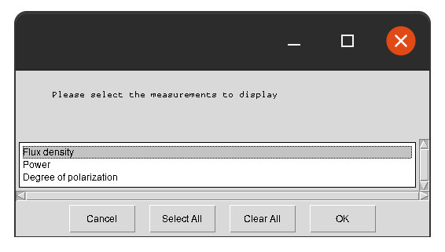
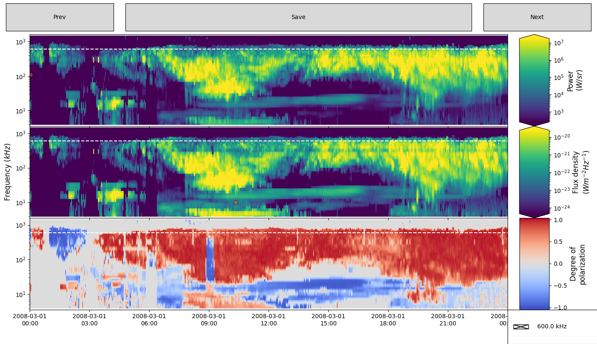
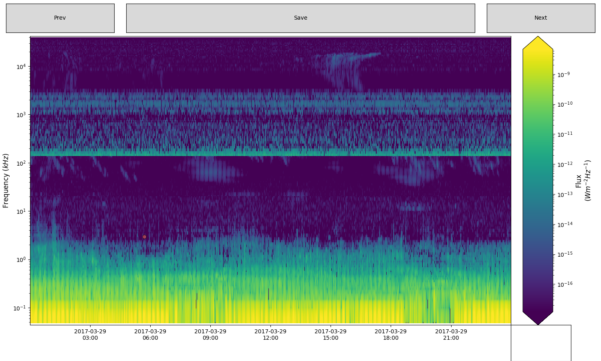

# Usage Examples

## `hdf5` file
Calling the code as:
```shell
space_label.py cassini_data.hdf5 2006-02-10 2006-02-11 -g 600
```
Will load the file `cassini_data.hdf5`, and prompt the user to select which measurements to display:



Once selected, the radio observations will be displayed
for the time window 10/2/2006 to 11/2/2006:




The user can then draw polygon in one panel. The Figure below show Intensity (top panel) and Polarization (bottom panel) data. At the top right of the top panel one can see a polygon that has just been drawn and closed, with the window for naming the feature appearing at the top left of the graphics window.  Features can be selected on any pane, and will be mirrored on all other panes once named.
Other features have already been labelled, and appear in both intensity and polarisation views, with their names overlaid.


## `cdf` file
Calling the code as:
```shell
space_label.py juno_data.cdf 2017-03-29 2017-03-30
```
Will first load the file `juno_data.cdf`, processed it into `hdf5` file (according to the `juno.json` config file), and then radio observations will be displayed for the time window 29/03/2017 to 30/03/2017:



An other example of a cdf file that also contains 1D data (displayed as a white-dashed line):
```shell
space_label.py polar_data.cdf 2017-03-29 2017-03-30
```
Will first load the file `polar_data.cdf`, processed it into `hdf5` file (according to the `polar.json` config file), and then radio observations will be displayed for the time window 26/03/1996 to 27/03/1996:

